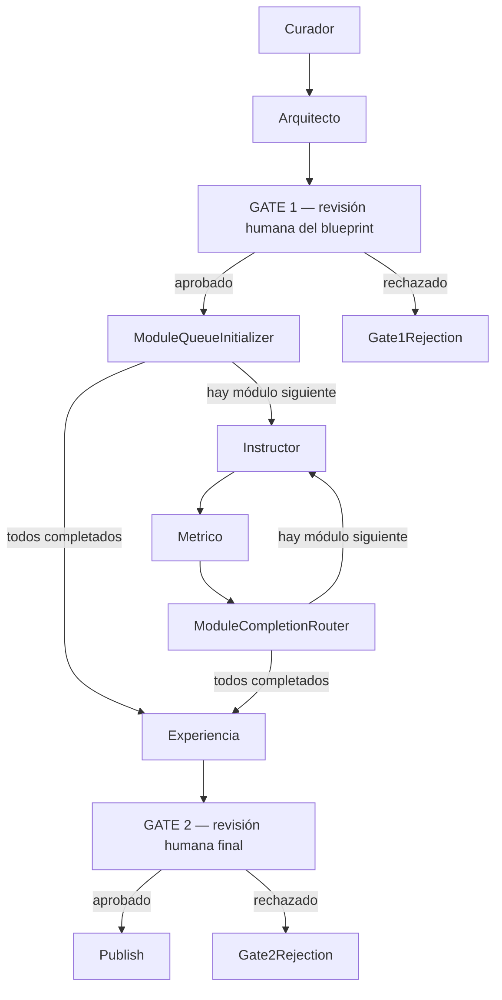

# Human OS Studio — Documentación del sistema multiagente

> Motor de creación de capabilities (cursos) de Human OS. Un experto en un
> tema aporta material crudo (PDFs, transcripciones de video, links, notas)
> y un pipeline de 5 agentes de IA lo transforma en una capability completa
> — niveles, módulos, guiones pedagógicos y una base de conocimiento para
> un tutor-IA en tiempo real — con revisión humana obligatoria antes de
> publicar.

## 1. Objetivo y filosofía

Human OS Studio existe para resolver un problema concreto de los cursos
generados por IA: **la IA hace el pensamiento POR el alumno** (escribe la
respuesta, resuelve el ejercicio) y el alumno "termina" el curso sin haber
aprendido nada. Esto se llama **cognitive offloading** y es el enemigo
número uno del diseño pedagógico de Human OS.

**REGLA DE ORO** (nunca se rompe, está grabada en los 3 agentes que generan
contenido): *"saber dónde buscarlo" NO es "saberlo"*. El alumno siempre
debe producir algo — ningún agente debe hacer el trabajo cognitivo por él.

Human OS Studio conecta con la filosofía central de Human OS (ver
[/memories/repo/human-os-core-philosophy.md](../../../memories/repo/human-os-core-philosophy.md)):
la plataforma no mide horas de estudio ni certificados, mide **capacidades
adquiridas, retención de conocimiento, dominio demostrado y aplicación
real**. Studio es la fábrica que produce ese contenido siguiendo esa misma
vara de medir.

## 2. Los 7 principios de neurociencia del aprendizaje (el CÓMO)

Aplicados siempre por el agente Instructor (y verificados por el agente
Métrico) al escribir cualquier guion. Solo la *intensidad* cambia según el
nivel (Foundation → Creator); los principios en sí nunca cambian:

| # | Principio | Idea central |
|---|---|---|
| P1 | **Prediction error** | El cerebro aprende cuando algo NO coincide con lo esperado. El alumno siempre debe predecir ANTES de que se revele la respuesta. |
| P2 | **Two systems** | Primero el conocimiento lento y deliberado, luego la intuición automática. Practicar, no solo leer. |
| P3 | **Desirable difficulties** | La dificultad AHORA es retención DESPUÉS. Añadir fricción productiva, no facilitarlo todo. |
| P4 | **Encoding specificity** | La memoria se recupera mejor en el contexto en que se usó. Usar material real y propio del alumno, no ejemplos genéricos. |
| P5 | **Schema** | El cerebro almacena conocimiento como red conectada. Conectar siempre la idea nueva con algo que el alumno ya sabe. |
| P6 | **Consolidation** | La memoria se fija con el tiempo (y el sueño). Programar repaso espaciado, calibrado al nivel (~1-3-7 días). |
| P7 | **Anti-offloading** | El alumno SIEMPRE produce; el agente NUNCA responde por él. La ventaja competitiva #1 de Human OS. |

P1 (predecir), P5 (esquema) y P3 (fricción) son **transversales**: se
aplican en TODO guion, sin importar cuál sea la métrica objetivo. P3, P7 y
P6 además ya están reflejados estructuralmente en el sistema de métricas
(Recall, Independence y Retention respectivamente).

> **Pregunta abierta, deliberadamente sin resolver** (documentada en
> `InstructorAgent.cs`): hoy la fricción escala solo por NIVEL. Hipótesis
> sin validar: la fricción debería depender de nivel × métrica (p. ej.
> Confidence podría necesitar fricción baja incluso en niveles altos).
> Pendiente de datos reales de usuarios antes de tocarlo.

## 3. Las dos dimensiones de cada módulo

Todo módulo vive en la intersección de dos coordenadas que el agente
Arquitecto decide deliberadamente — su trabajo más importante:

### Dimensión 1 — Los 6 niveles (`HumanEvolutionLayer`)

El scaffolding (ayuda dada) baja de ALTO a CERO a medida que se avanza:

1. **Foundation** — primer contacto, no sabe nada aún. Ayuda alta, fricción baja.
2. **Exploration** — descubre, prueba variantes. Aún mucha guía.
3. **Mastery** — convierte intereses en capacidades; ayuda media, ejecuta con fluidez.
4. **Professional** — convierte capacidades en VALOR real; casi solo, bajo presión real.
5. **Frontier** — se adapta a lo nuevo/incierto; ayuda mínima, maneja ambigüedad.
6. **Creator** — crea cosas nuevas, enseña a otros. Ayuda CERO — el conocimiento es 100% suyo.

### Dimensión 2 — Las 7 métricas (`CapabilityMetric`)

Qué habilidad concreta construye cada módulo en el cerebro:

1. **Knowledge** — entender el concepto, construir el mapa mental (esquema).
2. **Recall** — recordar SIN mirar, recuperación no asistida.
3. **Application** — usar lo aprendido en situaciones reales.
4. **Confidence** — confiar en el propio juicio (calibrado, ni exceso ni defecto).
5. **Independence** — hacerlo SIN ayuda de IA (anti-offloading).
6. **Retention** — no olvidar con el tiempo (espaciado).
7. **Fluency** — dominio total: ejecuta automáticamente, innova, y puede ENSEÑARLO a otros (enseñar es solo el peldaño más alto de esta métrica, no una métrica aparte).

> **Nota de nombres**: `Fluency` (métrica) y `Mastery` (nivel) son conceptos
> distintos que antes compartían el mismo nombre ("Mastery" para ambos).
> Se renombró la métrica a `Fluency` en 2026-07-13 para eliminar la
> ambigüedad en la UI y en los prompts — el nivel `Mastery` no se tocó.

### La matriz 6×7

El Arquitecto usa esta matriz (fila = métrica, columna = nivel) para
decidir qué debe generar cada módulo. Ejemplo de fila (Knowledge):
`Foundation=construir un esquema nuevo`, `Exploration=explorar variantes`,
`Mastery=conectar esquemas`, `Professional=aplicar a un contexto real`,
`Frontier=extender a algo nuevo`, `Creator=generar su propio esquema`. Las
7 métricas tienen una progresión equivalente definida en
`ArquitectoAgent.cs`.

## 4. Selección de alcance (Scope Selection) — no siempre las 42 celdas

Un curso **no necesita cubrir toda la matriz** (6 niveles × 7 métricas = 42
celdas posibles) — necesita cubrir lo que su objetivo realmente exige. El
Arquitecto decide el alcance ANTES de diseñar cualquier módulo, siguiendo
reglas duras (*hard rules*):

- Mínimo 2 niveles, máximo 6 niveles.
- Nunca activar una métrica "por si acaso" — cada celda elegida debe servir
  un objetivo real del curso.
- **La profundidad debe ajustarse a la intensidad del objetivo**: un
  objetivo "rápido/repaso/básico" produce POCOS módulos por nivel (2-3) con
  guiones cortos; un objetivo transformador/experto justifica más módulos y
  guiones más ricos.
- **Nunca duplicar el mismo mecanismo sobre el mismo material** en dos
  módulos distintos (p. ej. dos ejercicios de repetición espaciada con las
  mismas palabras) — si dos niveles producirían módulos casi idénticos, se
  deben fusionar en uno que progrese en dificultad.
- La descripción de cada módulo solo puede prometer contenido que el
  corpus curado realmente respalda (el Instructor no puede inventar
  hechos fuera del corpus).

Antes de diseñar cualquier módulo, el Arquitecto debe escribir una
`ScopeDeclaration` de una frase: *"Scope: [niveles] x [métricas]. Reason:
[por qué, según el objetivo]."* — visible para el revisor humano en GATE 1.

## 5. Los 5 agentes

Todos son `ChatClientAgent` simples de Azure OpenAI con salida
estructurada (sin Harness/Skills — eso está reservado para el futuro
Agente-Tutor en tiempo real).

| Orden | Agente | Archivo | Rol |
|---|---|---|---|
| 1 | **Curador** | [Agents/Studio/CuradorAgent.cs](Agents/Studio/CuradorAgent.cs) | Recibe el material crudo del experto (PDF, transcripción, link, nota) y lo organiza en un **corpus curado**: resumen general + chunks etiquetados. Nunca inventa hechos. |
| 2 | **Arquitecto** | [Agents/Studio/ArquitectoAgent.cs](Agents/Studio/ArquitectoAgent.cs) | Decide el alcance (scope selection) y diseña el **blueprint**: entre 2 y 6 niveles, y por cada nivel un esqueleto de módulos (título, descripción, tipo, y la métrica objetivo `TargetMetric` de cada módulo). Su salida pasa por **GATE 1**. |
| 3 | **Instructor** | [Agents/Studio/InstructorAgent.cs](Agents/Studio/InstructorAgent.cs) | Escribe el **guion real** de cada módulo, uno a la vez, aplicando los 7 principios de neurociencia calibrados al nivel × métrica asignados. Es el agente que más responsabilidad tiene sobre si el alumno realmente aprende. |
| 4 | **Métrico** | [Agents/Studio/MetricoAgent.cs](Agents/Studio/MetricoAgent.cs) | **Verifica** (no adivina) si el guion que escribió el Instructor realmente logra la `TargetMetric` asignada por el Arquitecto, usando el mismo checklist P1-P7. Su alcance de métricas reportables está limitado (hard filter en código) al scope declarado por el Arquitecto — nunca puede "inventar" métricas fuera de alcance. |
| 5 | **Experiencia** | [Agents/Studio/ExperienciaAgent.cs](Agents/Studio/ExperienciaAgent.cs) | Ensambla todos los módulos completados en un `CapabilityPackage` y redacta la base de conocimiento consolidada (`TutorKnowledgeBase`) que usará el futuro Agente-Tutor en tiempo real (RAG) para responder preguntas del alumno. Su salida pasa por **GATE 2**. |

### Guía de tipos de módulo → métricas típicas (Métrico la usa solo como referencia inicial)

`Lectura → Knowledge` · `Video → Knowledge + Recall` ·
`Practica → Application + Independence` · `SimuladorIA → Confidence + Application` ·
`Mentoria → Fluency + Confidence` (Mentoria aparece sobre todo en niveles
Frontier/Creator, donde el alumno empieza a enseñar o guiar a otros).

## 6. El pipeline (Workflow)

Construido con **Microsoft Agent Framework**
(`Microsoft.Agents.AI.Workflows`), orquestado por
[Agentic/Studio/CapabilityCreationWorkflowFactory.cs](Agentic/Studio/CapabilityCreationWorkflowFactory.cs)
y ejecutado por
[Agentic/Studio/CapabilityCreationOrchestrator.cs](Agentic/Studio/CapabilityCreationOrchestrator.cs):



- **Instructor/Métrico corren secuencialmente, un módulo a la vez** (no en
  paralelo todavía) — el diseño ya está preparado para convertirse en un
  fan-out/fan-in real sin tener que tocar los agentes.
- **Los 2 gates son puntos de control humano obligatorios**: nada se
  genera contenido masivo sin que un humano apruebe el blueprint (GATE 1,
  antes de gastar generación de 20+ guiones), y nada se publica sin que un
  humano apruebe el paquete final (GATE 2).
- El prototipo actual corre **en memoria, en proceso** (sin Durable
  Functions, sin persistencia de runs en curso) — decisión de alcance del
  2026-07-13.

## 7. Persistencia (al publicar, tras GATE 2)

`Agentic/Studio/PublishExecutor.cs` guarda el paquete aprobado en Azure SQL
usando **EF Core 10** con el tipo nativo `vector` de Azure SQL
(`SqlVector<float>`):

- `Capability` — la capability publicada (nombre, descripción, dominio).
- `CapabilityLevel` — cada nivel (`HumanEvolutionLayer`) con su
  transformación humana.
- `CapabilityModule` — cada módulo con su guion final y tipo.
- `CapabilityModuleMetric` — las métricas verificadas por el agente
  Métrico para cada módulo (columna `string`, vía
  `HasConversion<string>()` sobre el enum `CapabilityMetric`).
- `CapabilityKnowledgeChunk` — el guion de cada módulo y el
  `TutorKnowledgeBase` consolidado, troceados y **embebidos** (deployment
  `text-embedding-ada-002`, 1536 dimensiones) para que el futuro
  Agente-Tutor en tiempo real haga RAG sobre ellos.

## 8. Stack técnico

- **Microsoft Agent Framework** (`Microsoft.Agents.AI.Workflows` /
  `Microsoft.Agents.AI.OpenAI`) para el grafo de agentes y los gates
  humanos.
- **Azure OpenAI** — chat (`gpt-5-mini`) para los 5 agentes, embeddings
  (`text-embedding-ada-002`) para la base de conocimiento del tutor.
- **EF Core 10** + **Azure SQL** con columna nativa `vector`.
- Todos los agentes son `ChatClientAgent` con salida estructurada
  (`RunAsync<T>`) — sin Harness/Skills; ese patrón se reserva para el
  Agente-Tutor en tiempo real (todavía no construido).

## 9. Qué NO está construido todavía

- El **Agente-Tutor en tiempo real** que consumirá `CapabilityKnowledgeChunk`
  vía RAG durante la experiencia interactiva del alumno (el
  `TutorKnowledgeBase` ya se genera y embebe, pero no hay runtime que lo
  use aún).
- Persistencia de runs del pipeline en curso (hoy vive solo en memoria del
  proceso).
- Fan-out/fan-in real para paralelizar Instructor/Métrico entre módulos.
- El motor de repetición espaciada / scheduling SM-2 para Practice/Recall
  descrito en
  [/memories/repo/adaptive-learning-engine-design.md](../../../memories/repo/adaptive-learning-engine-design.md)
  (referencia de diseño futuro, no implementado).

## 10. Reglas del framework (Paso 1 — fijadas 2026-07-14)

Antes de tocar los agentes, estas son las reglas que ninguna parte del
sistema podrá romper. Este paso solo **define y documenta** el marco —
no cambia todavía los prompts del Arquitecto, Instructor ni Métrico
(eso llega en un paso posterior).

### 10.1 Niveles activos

Aunque `HumanEvolutionLayer` sigue teniendo 6 valores en código (para no
forzar migraciones si se eliminaran), **el Arquitecto solo puede
seleccionar actualmente**:

```
Foundation
Exploration
Mastery
```

`Professional`, `Frontier` y `Creator` se conservan en el enum (ver
[Agents/Studio/StudioSharedTypes.cs](Agents/Studio/StudioSharedTypes.cs))
pero quedan **fuera del flujo activo** hasta una decisión explícita que
actualice esta regla.

### 10.2 Regla de nombres (métrica vs. nivel)

```
Mastery  = nivel   (HumanEvolutionLayer.Mastery)
Fluency  = métrica (CapabilityMetric.Fluency)
```

Nunca usar un nombre por el otro en código, prompts o UI.

### 10.3 Recall: mecanismo vs. métrica objetivo

Todo módulo debe contener un **momento explícito de recuperación no
asistida**: el alumno intenta recuperar conocimiento relevante antes de
consultar fuentes, pistas, ejemplos o IA. Esto **no** significa que todo
módulo tenga `TargetMetric = Recall`. La distinción oficial:

- **`RecallMechanism`** = la recuperación obligatoria y transversal dentro
  de CUALQUIER módulo, sin importar su `TargetMetric`.
- **`TargetMetric`** = la capacidad principal que el módulo busca
  verificar (una de las 7 `CapabilityMetric`).

Ejemplo: `TargetMetric: Application`, `RecallMechanism: Required` — el
alumno primero recupera los criterios de memoria y después los aplica.

Estados conceptuales de `RecallMechanism` (definidos en
`RecallMechanismStatus`, ver
[Agents/Studio/StudioSharedTypes.cs](Agents/Studio/StudioSharedTypes.cs) —
**concepto documentado solamente, todavía no evaluado por ningún agente**):

| Estado | Significado |
|---|---|
| `Missing` | No existe recuperación. |
| `WithCues` | El alumno recupera usando palabras clave o pistas. |
| `WithoutCues` | El alumno recupera sin materiales, pistas ni IA. |

### 10.4 Las 10 reglas

1. Cada módulo tiene exactamente una `TargetMetric`.
2. Todo módulo incluye un `RecallMechanism` explícito.
3. Recall solo será `TargetMetric` cuando el objetivo principal del
   módulo sea comprobar recuperación no asistida — nunca se asigna
   automáticamente solo porque exista un `RecallMechanism`.
4. Las métricas secundarias no se consideran verificadas automáticamente.
5. `Confidence` requiere declaración de confianza y comparación con el
   desempeño real.
6. `Independence` requiere una ejecución posterior sin pasos, ejemplos,
   pistas, checklist ni respuestas de IA.
7. `Retention` requiere evidencia obtenida después de un intervalo;
   programarla no significa verificarla.
8. El agente Métrico debe identificar evidencia concreta, ubicación en
   el guion y condición de éxito.
9. `Foundation`, `Exploration` y `Mastery` son los únicos niveles que el
   Arquitecto puede seleccionar actualmente.
10. `Frontier` no forma parte del blueprint inicial.

### 10.5 Qué NO cambió en este paso

- No se implementó lógica de evaluación de `RecallMechanism` (solo el
  concepto y el enum `RecallMechanismStatus`).
- No se modificaron los prompts (`Instructions`) del Arquitecto,
  Instructor ni Métrico.
- No se eliminó ningún valor de `HumanEvolutionLayer` ni `CapabilityMetric`.

## 11. Paso 2 — contrato verificable del Arquitecto (2026-07-14)

Cada módulo del blueprint declara ahora, obligatoriamente, 4 campos (ver
[Agents/Studio/ArquitectoAgent.cs](Agents/Studio/ArquitectoAgent.cs)'s
`ModuleSkeleton`):

| Campo | Significado |
|---|---|
| `TargetMetric` | La única capacidad principal que el módulo pretende verificar (nunca una lista). |
| `RecallRequirement` | Lo que el alumno debe intentar recuperar de memoria ANTES de explicaciones, ejemplos, pistas, fuentes o IA. |
| `LearnerProduction` | La evidencia observable concreta que debe crear el alumno. |
| `SuccessCriteria` | Entre 2 y 5 condiciones observables para evaluar esa producción (nunca consumo de contenido, tiempo o finalización). |

`RecallRequirement` **no** implica `TargetMetric = Recall` — son conceptos
independientes (ver §10.3). El Arquitecto solo DECLARA este contrato; si
fue realmente implementado lo verifican el Instructor (Paso 3) y el
Métrico (paso futuro).

**Validación determinista**: `Agents/Studio/BlueprintValidator.cs` corre
justo después de la llamada al LLM, ANTES de que el blueprint llegue a
GATE 1 — rechaza (con `InvalidOperationException`) cualquier módulo sin
los 4 campos, cualquier `SuccessCriteria` fuera del rango 2-5 o vacío, y
cualquier nivel fuera de `BlueprintValidator.ActiveLevels` (Foundation,
Exploration, Mastery — ver §10.1). GATE 1 debe mostrar, por módulo:
TargetMetric, RecallRequirement, LearnerProduction y SuccessCriteria, para
que el revisor humano detecte problemas antes de generar guiones.

## 12. Paso 3 — el Instructor implementa el contrato (2026-07-14)

El Instructor ya no puede limitarse a "mencionar" el contrato aprobado en
una explicación — debe implementarlo de forma explícita y verificable,
tanto en el guion narrativo como en su salida estructurada (ver
[Agents/Studio/InstructorAgent.cs](Agents/Studio/InstructorAgent.cs)):

```csharp
public sealed class ModuleScript
{
    public string Script { get; set; }              // guion narrativo completo
    public CapabilityMetric TargetMetric { get; set; }  // debe = el aprobado
    public RecallActivity RecallActivity { get; set; }  // recuperación implementada
    public string LearnerTask { get; set; }             // tarea de producción explícita
    public List<string> SuccessCriteria { get; set; }   // los mismos aprobados
}

public sealed class RecallActivity
{
    public string Instructions { get; set; }
    public bool OccursBeforeInstruction { get; set; }   // debe ser true
    public RecallSupportLevel SupportLevel { get; set; } // WithCues | WithoutCues
}
```

### 12.1 Regla de Recall por nivel

| Nivel | Regla |
|---|---|
| Foundation | Primer intento sin ayuda; pistas limitadas solo DESPUÉS de ese intento. |
| Exploration | Recupera los criterios ANTES de aplicarlos a un caso/variación/material real. |
| Mastery | Recupera SIN pistas, ejemplos, checklist, fuentes ni IA (`SupportLevel = WithoutCues`, obligatorio en código). |

La regla transversal **RECALL FIRST** aplica siempre: la recuperación
ocurre ANTES de cualquier explicación, ejemplo, pista, palabra clave,
checklist, contenido de fuente o ayuda de IA — sin excepción de nivel.

### 12.2 Reglas de fidelidad al contrato

- **Una sola TargetMetric**: el Instructor debe repetir exactamente la
  `TargetMetric` aprobada; no puede cambiarla ni convertirla en una lista
  (p. ej. `Application + Confidence + Independence`).
- **Producción del alumno**: `LearnerTask` debe pedir directamente que el
  alumno cree la `LearnerProduction` aprobada — la IA nunca genera esa
  evidencia por él.
- **Criterios de éxito**: los `SuccessCriteria` aprobados se incluyen sin
  cambios, para que el alumno los use para revisar SU PROPIA producción
  después de producir (nunca antes, como plantilla).
- **Métricas secundarias prohibidas**: el guion puede apoyar otras
  capacidades indirectamente, pero solo la `TargetMetric` se reporta como
  verificada — Confidence/Independence/Retention/Recall/Fluency no se
  declaran verificadas solo por aparecer como efecto secundario.

### 12.3 Validación determinista

`Agents/Studio/ModuleScriptValidator.cs` corre dentro de
`InstructorAgent.WriteScriptAsync`, justo después de la llamada al LLM,
ANTES de que el guion llegue al Métrico. Rechaza (con
`InvalidOperationException`):

1. `output.TargetMetric` distinta de la aprobada.
2. `RecallActivity.Instructions` vacío.
3. `RecallActivity.OccursBeforeInstruction == false`.
4. `LearnerTask` vacío.
5. Menos de 2 `SuccessCriteria`.
6. Nivel `Mastery` con `SupportLevel != WithoutCues`.

### 12.4 Conteo de tokens (secundario)

`AgentTokenUsage` (en
[Agents/Studio/StudioSharedTypes.cs](Agents/Studio/StudioSharedTypes.cs))
registra `InputTokens`/`OutputTokens` reportados por Azure OpenAI
(`AgentResponse.Usage`) para cada llamada del Instructor, acumulados en
`PipelineState.TokenUsage` (por ahora solo conteo — sin cálculo de costos,
sin afectar la lógica pedagógica).

### 12.5 Qué NO cambió en este paso

- No se modificó `MetricoAgent.cs`.
- No se verifica todavía si el guion implementó Recall de forma
  pedagógicamente correcta más allá de las 6 reglas deterministas de
  §12.3 — esa verificación semántica sigue siendo trabajo futuro del
  Métrico.
- No se verifica Confidence/Independence/Retention como efecto secundario.
- No se incorporó `Frontier` ni se calculan costos monetarios.

## 13. Paso 4 — el Métrico verifica con evidencia real (2026-07-14)

El Métrico ya no infiere una lista de métricas de forma genérica — verifica
ÚNICAMENTE la `TargetMetric` aprobada, con evidencia precisa y por criterio
(ver [Agents/Studio/MetricoAgent.cs](Agents/Studio/MetricoAgent.cs)):

```csharp
public sealed class MetricVerification
{
    public string ModuleId { get; set; }                 // eco exacto del módulo
    public CapabilityMetric TargetMetric { get; set; }    // debe = el aprobado
    public MetricVerificationStatus Status { get; set; }  // Verified | NotVerified | Failed
    public string Evidence { get; set; }                  // producción observable del alumno
    public string EvidenceLocation { get; set; }           // dónde exactamente en el guion
    public List<SuccessCriterionResult> SuccessCriteriaResults { get; set; } // uno por criterio aprobado
    public RecallVerification Recall { get; set; }         // verificación independiente de Recall
    public string Explanation { get; set; }                // por qué esa evidencia demuestra (o no) la métrica
}

public sealed class SuccessCriterionResult
{
    public string Criterion { get; set; }
    public bool IsSatisfied { get; set; }
    public string Evidence { get; set; }   // nunca "los criterios están presentes"
}

public sealed class RecallVerification
{
    public RecallVerificationStatus Status { get; set; }  // Missing | WithCues | WithoutCues
    public string Evidence { get; set; }
    public string EvidenceLocation { get; set; }
    public bool OccursBeforeInstruction { get; set; }
}
```

### 13.1 Principio central

> Una métrica no está verificada porque el guion parezca apoyarla; necesita
> evidencia observable, ubicación exacta y criterios de éxito cumplidos.

### 13.2 Regla de una sola métrica (SINGLE TARGET METRIC)

El Métrico verifica ÚNICAMENTE la `TargetMetric` aprobada. Nunca reporta
Confidence, Independence, Retention, Recall, Fluency u otra métrica como
verificada solo porque el guion parece tocarla como efecto secundario. El
tipo `MetricVerification` en sí mismo no tiene espacio para una lista de
métricas secundarias — la garantía es estructural, no solo de prompt.

### 13.3 Reglas especiales por métrica (guía de prompt, no validación de texto)

| Métrica | Requisito para `Verified` |
|---|---|
| Knowledge | Representación propia del alumno (explicación, mapa conceptual, comparación, clasificación razonada). |
| Recall | Recuperación sin consultar la respuesta. |
| Application | Uso del conocimiento para producir un resultado en un caso/contexto real. |
| Confidence | Confianza declarada ANTES + desempeño real + comparación explícita entre ambos. |
| Independence | Ejecución sin pasos, ejemplos, pistas, checklist, fuentes ni respuestas de IA. |
| Retention | Evidencia obtenida DESPUÉS de un intervalo real — programar una actividad no es verificarla. |
| Fluency | Ejecución consistente, precisa, adaptable o explicable — una respuesta aislada no basta. |

Estas reglas viven en el prompt del Métrico (juicio semántico del LLM); el
mecanismo genérico "todos los `SuccessCriteria` deben cumplirse para
`Verified`" es lo que las hace cumplir en la práctica, siempre que el
Arquitecto haya escrito criterios que realmente codifiquen cada regla
(p. ej. un criterio de calibración para un módulo con `TargetMetric =
Confidence`).

### 13.4 Recall: verificación independiente

El Métrico re-verifica el guion por sí mismo — no copia el
`RecallActivity` que el Instructor autoreportó. Reporta `Missing`,
`WithCues` o `WithoutCues`, con evidencia y ubicación propias, y si
`OccursBeforeInstruction == false` para cualquier estado distinto de
`Missing`, la verificación es inválida. La existencia de una actividad de
Recall **no** implica que Recall sea la `TargetMetric` — son conceptos
independientes (ver §10.3).

### 13.5 Validación determinista

`Agents/Studio/MetricVerificationValidator.cs` corre dentro de
`MetricoAgent.AssignMetricsAsync`, justo después de la llamada al LLM.
Rechaza (con `InvalidOperationException`):

1. `ModuleId` inesperado (no coincide con el módulo aprobado).
2. `TargetMetric` distinta de la aprobada.
3. `EvidenceLocation` vacío.
4. Número de `SuccessCriteriaResults` distinto al número de
   `SuccessCriteria` aprobados.
5. Cualquier `SuccessCriterionResult` sin su propia `Evidence`.
6. `Status = Verified` sin `Evidence`/`Explanation`, o con algún
   criterio `IsSatisfied = false`.
7. Recall con `Status != Missing` pero `OccursBeforeInstruction == false`.
8. `Recall.Evidence` vacío.

### 13.6 Persistencia (compatibilidad con el esquema existente)

`ModuleMetricAssignment` (consumido por `MetricoExecutor.cs`/
`PublishExecutor.cs`) se sigue construyendo en código a partir del
`MetricVerification` — `Metrics` contiene la `TargetMetric` SOLO si
`Status == Verified`; nunca se fuerza su inclusión (la antigua red de
seguridad "insertar siempre la TargetMetric" se eliminó por contradecir
el principio central). El esquema `CapabilityModuleMetric` en la base de
datos no tiene columnas para evidencia/ubicación/estado todavía — el
detalle completo se conserva en `ModuleMetricAssignment.Verification`
para uso futuro, y el `Rationale` de texto persiste un resumen legible de
esa verificación.

### 13.7 Conteo de tokens (secundario)

Igual que el Instructor (§12.4): `AgentTokenUsage` con `AgentName =
"Metrico"` se agrega a `PipelineState.TokenUsage` por cada verificación —
sin cálculo de costos, sin afectar la lógica pedagógica.

### 13.8 Qué NO cambió en este paso

- No se modificaron `ArquitectoAgent.cs` ni `InstructorAgent.cs`.
- No se incorporó `Frontier` ni se calculan costos monetarios.
- No se persiste todavía el detalle evidencia/ubicación/estado en la base
  de datos (solo en memoria, vía `ModuleMetricAssignment.Verification`).

## 14. Paso 5 — bloquear módulos sin evidencia válida (2026-07-14)

Que el Instructor y el Métrico hayan terminado de ejecutarse **no** significa
que un módulo esté completo. El pipeline ahora distingue explícitamente
"contenido generado" de "capacidad verificada" (ver
[Agents/Studio/StudioSharedTypes.cs](Agents/Studio/StudioSharedTypes.cs),
[Agents/Studio/CompletedModuleValidator.cs](Agents/Studio/CompletedModuleValidator.cs),
[Agentic/Studio/ModuleCompletionGate.cs](Agentic/Studio/ModuleCompletionGate.cs)):

```csharp
public enum ModuleProcessingStatus
{
    Pending, GeneratingScript, ScriptGenerated, VerifyingMetric,
    Verified,          // única condición que cuenta como "módulo completo"
    RequiresRevision,  // evidencia insuficiente — resultado pedagógico legítimo
    Failed             // violación estructural del contrato entre agentes
}
```

### 14.1 Un módulo se completa únicamente cuando

`Instructor implementó el contrato` + `Recall presente y correcto` +
`el alumno produce evidencia observable` + `Métrico verificó la
TargetMetric` + `todos los criterios obligatorios se cumplieron`. Ninguna
combinación parcial de estas condiciones cuenta como "completo".

### 14.2 `CompletedModuleValidator` — el gate final

Corre dentro de `MetricoExecutor.cs`, justo después de que el Métrico
responde, con el `ModuleSkeleton` aprobado, el `ModuleScript` del
Instructor, el `MetricVerification` del Métrico y el `HumanEvolutionLayer`
del módulo. Distingue DOS tipos de "no completo":

- **Violación estructural del contrato** (TargetMetric distinta entre
  Instructor/Métrico/Blueprint, Recall que no ocurre antes de la
  instrucción, Mastery con pistas, o un número de `SuccessCriteriaResults`
  que no coincide con los `SuccessCriteria` aprobados) — esto NO debería
  ocurrir si los validadores de los Pasos 3 y 4 ya corrieron
  correctamente; si ocurre aquí es un bug real, no un juicio pedagógico.
  Se lanza `InvalidOperationException`, capturada por `MetricoExecutor.cs`
  y mapeada a `ModuleProcessingStatus.Failed` (con el mensaje guardado en
  `CompletedModule.FailureReason`).
- **Resultado pedagógico legítimo** (`MetricVerification.Status` distinto
  de `Verified`, o — por invariante extra — algún criterio no satisfecho)
  — esto es normal y esperado; el validador devuelve
  `ModuleProcessingStatus.RequiresRevision` sin lanzar excepción. El
  contenido existe, pero la evidencia todavía no demuestra la métrica.

### 14.3 El router solo avanza a Experiencia cuando TODOS están `Verified`

`Agentic/Studio/ModuleCompletionGate.cs` expone dos predicados puros,
conectados a las aristas condicionales del workflow
(`CapabilityCreationWorkflowFactory.cs`):

- `IsAllVerified` — cierto solo cuando la generación terminó Y todos los
  módulos están `Verified`. Es la ÚNICA condición que activa
  `ExperienciaExecutor`.
- `RequiresRevision` — cierto cuando la generación terminó pero al menos
  un módulo quedó `RequiresRevision` o `Failed`. Activa un nuevo paso
  terminal, `ModuleRevisionRequiredExecutor`, que termina el run sin
  invocar a Experiencia/GATE 2/Publish, devolviendo un
  `ModuleGenerationOutcome` con TODOS los módulos (para que el revisor
  humano vea exactamente cuáles necesitan atención).

Instructor y Métrico siguen ejecutándose para TODOS los módulos de la cola
(el bucle secuencial no se detiene en el primer módulo problemático) — la
única diferencia es que, al vaciarse la cola, el resultado consolidado ya
no se trata automáticamente como "capability lista"; debe pasar el gate.

### 14.4 Eventos de progreso por resultado real

`MetricoExecutor.cs` ahora emite un evento distinto según el resultado real
del módulo (no solo "el Métrico terminó"): `ModuleVerifiedEvent`,
`ModuleRequiresRevisionEvent` (con el motivo, tomado del `Rationale` de la
verificación) o `ModuleProcessingFailedEvent` (con el `FailureReason`) —
ver [Agentic/Studio/StudioProgressEvents.cs](Agentic/Studio/StudioProgressEvents.cs).
Los tres cuentan igual para el progreso "N de Total módulos procesados",
pero solo `Verified` cuenta para el gate de la sección 14.3.

### 14.5 Conteo de tokens (sin cambios de comportamiento)

Los reintentos de una llamada (a Instructor o Métrico) siguen sumando
nuevas entradas a `PipelineState.TokenUsage` — el historial nunca se
reemplaza, solo se acumula. La validación determinista de
`CompletedModuleValidator` no consume tokens (es código puro, sin llamada
al LLM).

### 14.6 Qué NO cambió en este paso

- No se modificaron `ArquitectoAgent.cs`, `InstructorAgent.cs` ni
  `MetricoAgent.cs` (solo el código que CONECTA sus validaciones ya
  existentes con el workflow).
- No se incorporó `Frontier` ni se calculan costos monetarios.
- No se implementó todavía un mecanismo de reintento automático desde la
  UI para módulos `RequiresRevision`/`Failed` — el run simplemente termina
  con `ModuleGenerationOutcome`, listo para que un paso futuro decida cómo
  reintentar.

## 15. Paso 6 — persistencia del detalle de verificación en SQL (2026-07-14)

El detalle completo de `MetricVerification` (evidencia, ubicación,
explicación, cada `SuccessCriterionResult`, y la verificación independiente
de Recall) ya no vive solo en memoria — se persiste en dos tablas nuevas:

- `CapabilityModuleVerification` (1 fila por intento de verificación de un
  módulo): `TargetMetric`, `Status`, `Evidence`, `EvidenceLocation`,
  `Explanation`, `RecallStatus`, `RecallEvidence`,
  `RecallEvidenceLocation`, `RecallOccursBeforeInstruction`, `CreatedDate`.
- `CapabilityModuleSuccessCriterionResult` (una fila por criterio
  evaluado, hijas de `CapabilityModuleVerification`): `Criterion`,
  `IsSatisfied`, `Evidence`, `SortOrder`.

Diseño **append-only** (sin restricción de unicidad sobre
`CapabilityModuleId`): un futuro reintento/regeneración de un módulo debe
agregar una fila NUEVA aquí, no sobrescribir el intento anterior — mismo
principio "historial, no sobrescritura" ya usado para `AgentTokenUsage`.

`Agentic/Studio/PublishExecutor.cs` construye estas filas a partir de
`ModuleMetricAssignment.Verification` en el mismo momento en que persiste
`CapabilityModuleMetric` (la lista simple que ya existía) — ambas
conviven: `CapabilityModuleMetric` sigue siendo la lista simple para
consultas rápidas, `CapabilityModuleVerification` es el detalle completo
para auditoría/revisión humana.

**Migración**: `Data/Migrations/20260714180910_AddCapabilityModuleVerification.cs`,
aplicada contra la base de datos real (`dotnet ef database update`).
Verificada con un endpoint de depuración TEMPORAL (creado, probado con un
round-trip real insertar→leer→borrar, y eliminado en la misma sesión) —
confirma que el mapeo EF Core es correcto contra la base de datos real,
no solo contra el modelo en memoria.

**Hallazgo real durante las pruebas end-to-end**: al generar contenido por
primera vez (sin que un alumno real lo haya completado todavía), el
Métrico frecuentemente marca módulos como `NotVerified` porque el guion es
una plantilla de instrucciones, no una entrega ya completada — no hay
"evidencia observable" todavía en el sentido estricto que exige el Paso 4.
Esto es coherente con el diseño (evita falsos positivos), pero significa
que en la práctica muchos runs de generación terminarán en
`RequiresRevision` hasta que exista un mecanismo real de reintento o hasta
que se reconsidere qué cuenta como "evidencia" en tiempo de generación
vs. en tiempo de uso real por un alumno — **no resuelto en este paso,
señalado para una decisión futura**.

### Qué NO cambió en este paso

- No se modificaron `ArquitectoAgent.cs`, `InstructorAgent.cs`,
  `MetricoAgent.cs` ni la lógica de `CompletedModuleValidator`/
  `ModuleCompletionGate`.
- No se implementó el mecanismo de reintento (sigue pendiente, ver §14.6).
- No se resolvió la tensión Métrico-en-tiempo-de-generación descrita arriba.

## 16. Paso 7 — reintento acotado + umbral de publicación al 85% (2026-07-14)

Resuelve el pendiente señalado en §14.6/§15: ahora existe un mecanismo real
de reintento para módulos que no llegan a `Verified`, más un umbral de
publicación a nivel de capacidad — dos cambios deliberadamente
**independientes**, ninguno relaja el criterio de evidencia por módulo/
criterio (ese sigue siendo responsabilidad exclusiva de `CompletedModuleValidator`/
Métrico, sin cambios en este paso).

### 16.1 Reintento acotado — mismo agente, mismo prompt, más contexto

Cuando un módulo NO llega a `Verified`, `ModuleCompletionRouterExecutor`
(no un agente nuevo, no un Skill) reenvía el MISMO módulo al MISMO
`InstructorAgent` hasta `MaxRetries = 2` veces (3 intentos totales) antes
de aceptar el resultado como final:

```csharp
internal const int MaxRetries = 2;
```

Cada reintento agrega un `RevisionContext` (guion anterior + feedback
concreto de Métrico, o el mensaje de la excepción si fue `Failed`) al
`ModuleWorkItem`; `InstructorAgent.WriteScriptAsync` recibe este contexto
como parámetro opcional y, si está presente, agrega un bloque adicional al
mismo prompt: "aquí está tu intento anterior, aquí está por qué fue
rechazado, corrige SOLO eso". Se evaluó explícitamente usar
Harness+Skills del Microsoft Agent Framework para esto y se descartó: esa
maquinaria ya está reservada para el futuro Agente-Tutor en tiempo de
ejecución (ver doc comment en `CuradorAgent.cs`), no está conectada a
ningún agente de Studio hoy, y hubiera sido infraestructura nueva para un
problema que una rama de prompt resuelve sin agregar conceptos.

No se tocó el grafo del workflow (`CapabilityCreationWorkflowFactory.cs`):
la arista condicional que ya existía (`ModuleCompletionRouter ->
Instructor` cuando `NextModule` no es null) cubre tanto "siguiente módulo
nuevo" como "mismo módulo en reintento" — la diferencia vive enteramente
en el payload (`ModuleWorkItem.Attempt`/`Revision`), no en la topología del
grafo.

Un módulo que agota sus reintentos sin llegar a `Verified` se acepta como
resultado FINAL (Verified, RequiresRevision o Failed) recién en ese
momento, y solo entonces se agrega a `ModuleQueueState.Completed` — los
intentos intermedios rechazados no se persisten individualmente (solo el
resultado final por módulo llega a `PublishExecutor`/
`CapabilityModuleVerification`; ver §15's diseño append-only, pensado para
publicaciones repetidas de la misma capacidad, no para el historial de
reintentos de generación dentro de un mismo run).

### 16.2 Umbral de publicación al 85% (nivel capacidad, no nivel módulo)

`ModuleCompletionGate.MeetsPublishThreshold` (antes `IsAllVerified`) ya no
exige el 100% de los módulos en `Verified` — exige
`MinVerifiedRatio = 0.85`:

```csharp
public const double MinVerifiedRatio = 0.85;
```

Esto es un umbral **agregado, a nivel de la capacidad completa**, tomado
DESPUÉS de que el reintento del §16.1 ya agotó sus intentos — no cambia,
relaja ni reinterpreta qué significa `Verified` para un módulo individual.
`ExperienciaAgent` sigue recibiendo la lista COMPLETA de módulos
(incluyendo los que quedaron `RequiresRevision`/`Failed`, con su `Status`
intacto) — la capacidad puede publicarse con un subconjunto conocido de
módulos pendientes de atención, en vez de bloquear todo el run.

### 16.3 Qué NO cambió en este paso

- No se modificó `CompletedModuleValidator`, ni el criterio per-criterio/
  per-módulo de Métrico — la evidencia exigida a CADA módulo es la misma.
- No se persiste un historial completo de cada intento de reintento (solo
  el resultado final por módulo llega a la base de datos).
- No se actualizó el frontend para mostrar el nuevo estado "Reintentando"
  (`ModuleRetryingEvent`) — la UI de generación sigue usando un contador
  simulado, no polling real de estos eventos todavía.

